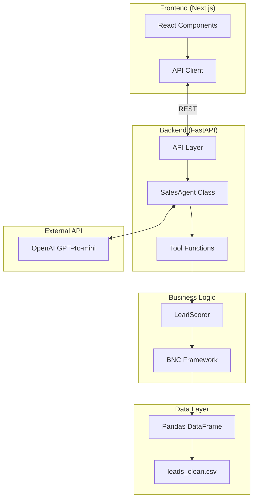
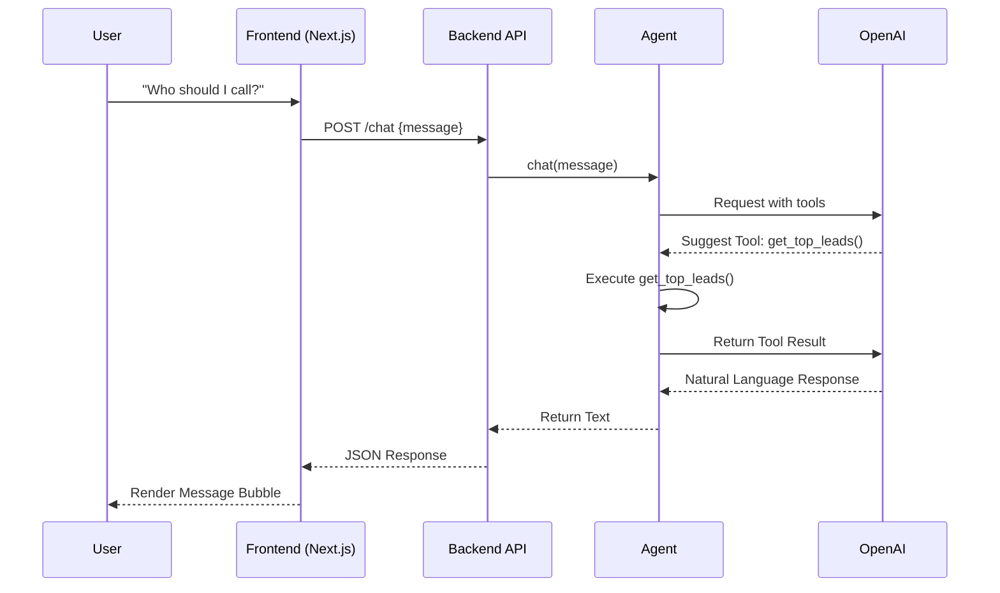
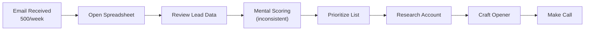
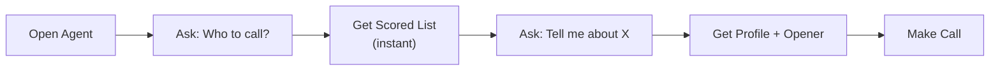

# SalesAgent-v2

## Tech Stack
FastAPI, OpenAI

## Metadata
- Has docs folder: True
- Has frontend: True
- Has backend: True

# SalesAgent-v2 Documentation


---

## From: architecture.md

# 🏗️ Architecture Overview

> [!NOTE]
> This document outlines the technical design of the Sales Lead Prioritization Agent, focusing on modularity, scalability, and grounding in real-world data.


## High-Level Architecture



---

## 🧩 Components

### 1. 🖥️ User Interface (`frontend/`)
- **Technology**: Next.js 14, React, Tailwind CSS
- **Features**: 
  - Modern, responsive chat interface
  - "Hot Lead" badge visualization
  - Real-time streaming responses
  - Slate-themed professional aesthetic

### 2. ⚡ API Layer (`src/api/main.py`)
- **Technology**: FastAPI
- **Features**:
  - RESTful endpoints (`/chat`, `/stats`)
  - Global Agent singleton management
  - CORS configuration for frontend decoupling
  - Swagger/OpenAPI documentation auto-generation

### 3. 🤖 Agent Core (`src/agent/core.py`)
- **Technology**: OpenAI SDK (function calling)
- **Features**:
  - 4 specialized tool functions
  - State management (currently in-memory)
  - Dynamic system prompts

### 4. 🧠 Scoring Engine (`src/logic/scoring.py`)
- **Framework**: BNC + Internal Gap
- **Logic**: Pure Python/Pandas implementation of the 75th percentile framework.

---

## 🖼️ Visual Architecture Diagram


---

## 🔄 Data Flow



---

## 🛠️ Technology Decisions

| Decision | Choice | Rationale |
|:---|:---|:---|
| **Frontend** | **Next.js + Tailwind** | Staff-level polish, component reusability, production standard. |
| **Backend** | **FastAPI** | High performance, auto-docs, native async support for AI. |
| **LLM** | OpenAI GPT-4o-mini | Cost-effective, sufficient reasoning capability. |
| **Data** | CSV + Pandas | Simplicity for the "Craft Demo" constraint. |

---

## 📂 File Structure

```
SalesAgent/
├── frontend/                # Next.js Application
│   ├── src/app/             # React Pages
│   └── public/              # Static assets
├── src/
│   ├── api/
│   │   └── main.py          # FastAPI Server
│   ├── agent/
│   │   └── core.py          # Agent Logic
│   ├── logic/
│   │   └── scoring.py       # BNC Scoring
│   └── ui/
│       └── app.py           # (Legacy) Streamlit
├── data/
│   └── processed/           # CSV Data
└── docs/
    ├── architecture.md      # This file
    └── requirements.md      # PRD
```


---

## From: assumptions.md

# 📝 Assumptions & Constraints

> [!NOTE]
> This document captures the data-level assumptions and problem constraints identified during the initial analysis phase.
## Lead Prioritization Agent - Data & Problem Understanding

---

## 1. Data Source

**Assumption**: The lead data has already been extracted and structured.
- Source file: `output_data.xlsx` (4,999 rows)
- Data represents: Existing accounts showing buying signals
- No email parsing needed: Data is clean and ready for analysis

**Implication**: Agent focuses on prioritization and reasoning, not data extraction.

---

## 2. Lead Type

**Assumption**: These are **expansion/upsell opportunities** (not cold leads).

**Evidence**:
- `days_since_signup` → Accounts already exist
- `sessions_per_month`, `contacts_per_month` → Usage data available
- `paid_optional_features_count` → Already monetized to some degree

**Implication**: Prioritization should identify "engagement vs monetization gap"
- High usage + low paid features = strong upsell signal
- High revenue = spending power indicator

---

## 3. User Goal

**Assumption**: Salesperson's primary question = "Who should I call TODAY?"

**What the agent must provide**:
- Ranked list of accounts
- Reasoning for each recommendation
- Actionable talking points

**Not just**: Filtered search results
**But**: Strategic recommendations with "why"

---

## 4. Data Quality

**Known issues**:
- Phone numbers: Some have "z" prefix (OCR artifacts)
- Revenue: String format with "$" and commas (needs parsing)
- Employees: Some have spaces (e.g., "3 949" = 3,949)
- Column names: Truncated (`account_contac`, `tp_nhaomnee_number`)

**Implication**: Need data cleaning step before analysis.

---

## 5. Data Duplication

**Assumption**: Some companies have multiple rows in the dataset.

**Evidence**:
- `company_name` column shows duplicates
- `days_since_signup` → Accounts already exist
- `sessions_per_month`, `contacts_per_month` → Usage data available

**Implication**: Need to handle duplicates before analysis.

---
## 6. Data Structure: Multi-Account Companies

**Discovery**: Every company in the dataset has multiple accounts (avg ~47 per company).

**Interpretation**: These represent:
- Different departments/divisions using the product independently
- Separate budgets and decision-makers
- Enterprise/mid-market companies with decentralized purchasing

**Implication for Agent**:
- Account-level scoring (who to call)
- Company-level insights (enterprise opportunity detection)
- Cross-account pattern recognition
- Strategic account planning (not just tactical lead prioritization)

**Example**: 
"Complete Technologie" has 62 accounts:
- 30 with <3 features (upsell targets)
- 12 with 30+ sessions (engaged users)
- Combined revenue: $900M+ (enterprise budget)
→ Recommendation: Coordinate multi-account strategy

---

## 5. Column Interpretations

**No data dictionary was provided.** These interpretations are assumptions:

| Column | Our Interpretation | Confidence |
|--------|-------------------|------------|
| `sessions_per_month` | Product login sessions (usage) | Medium - could be sales meetings |
| `contacts_per_month` | Active users/seats at account | Medium - could be support contacts |
| `days_since_signup` | Account age | High |
| `revenue_usd` | Company annual revenue | High |

**Interview note**: First question to business would be "Can I get a data dictionary?"

---

## 6. Scoring Logic Rationale

**Why equal weights?**
- No historical conversion data to validate which signals matter more
- Starting with assumptions we can't defend would be bad practice
- In production: A/B test weights, optimize based on actual conversions

**Why 75th percentile thresholds?**
- Top 25% is a standard, defensible statistical approach
- Dynamic: adapts if customer base changes
- Easy to explain: "We target the top quarter"

**Why Internal Gap signal?**
- Data showed 105 companies with ~47 accounts each
- If one department adopted features, others are warm leads
- Sales angle: "Your colleagues in [dept] already use this"

---

## 7. What We Chose NOT to Include

| Column | Why Excluded from Scoring |
|--------|---------------------------|
| `number_of_employees` | Correlation with features: -0.002 (no signal) |
| `number_of_subsidiaries` | Correlation with features: -0.0004 (no signal) |
| `days_since_signup` | Correlation: -0.008. Used as context, not score |

**Key insight**: Almost no correlation between any column and `paid_optional_features_count`. This validates the "gap" approach - opportunity is about relative position, not absolute values.

## Next: To be added as we build
- Agent capabilities definition
- Scoring logic rationale  
- Technical architecture decisions
- LLM integration approach


---

## From: business_case.md

# 💼 Business Case: Lead Prioritization Agent

> [!IMPORTANT]
> Automating lead prioritization for the sales team using an AI agent can save approximately **208 hours per year** across a team of 10 reps, delivering an estimated **$12,500 annual ROI**.

---

## Current State (Manual Process)

### Process Map



### Time Spent (Per Rep, Per Week)

| Activity | Time (min) | Notes |
|----------|------------|-------|
| Review 500 emails | 60 | Quick scan |
| Score/prioritize leads | 45 | Mental BNC assessment |
| Research top accounts | 30 | Company lookup, history |
| Craft talking points | 30 | Custom for each lead |
| **Total** | **165 min** | ~2.75 hours/week |

### 🛑 Issues with Manual Process
1. **Inconsistent scoring** - Each rep has different criteria
2. **Missed opportunities** - No visibility into internal gaps
3. **Time drain** - Repetitive work takes focus from selling
4. **No institutional knowledge** - Scoring logic lives in heads

---

## Future State (Automated)

### Process Map



### Time Spent (Per Rep, Per Week)

| Activity | Time (min) | Improvement |
|----------|------------|-------------|
| Open agent, ask question | 5 | -55 min |
| Review AI-scored list | 10 | -35 min |
| Get talking points | 5 | -25 min |
| **Total** | **20 min** | **-145 min** |

---

## 💰 ROI Calculation

### 📋 Assumptions

| Parameter | Value | Notes |
|:---|:---|:---|
| Reps using system | 10 | Sales team size |
| Time saved per rep/week | 145 min | 2.4 hours |
| Weeks per year | 52 | |
| Loaded hourly cost | $50 | Salary + benefits |
| OpenAI API cost/month | $20 | ~1000 queries/month |

### 📈 Annual Savings

> [!NOTE]
> **Total Savings Calculation:**
> - Time saved = 10 reps × 145 min × 52 weeks = 754,600 min = 208 hours
> - Dollar value = 208 hours × $50/hour = $10,400
> - API cost = $20 × 12 = $240
> - **Net savings = $10,160/year**

### Development Investment

| Item | Hours | Cost @ $100/hr |
|------|-------|----------------|
| Data cleaning | 4 | $400 |
| Scoring logic | 4 | $400 |
| Agent development | 8 | $800 |
| UI development | 4 | $400 |
| Testing/documentation | 4 | $400 |
| **Total** | **24** | **$2,400** |

### Payback Period

```
Payback = $2,400 / ($10,160 / 12) = 2.8 months
```

---

## Qualitative Benefits

| Benefit | Impact |
|---------|--------|
| **Consistent scoring** | All reps use same BNC framework |
| **Internal gap detection** | Identifies cross-sell within companies |
| **Faster ramp** | New reps productive immediately |
| **Data-driven culture** | Decisions backed by numbers |
| **Conversation context** | Agent remembers within session |

---

## Risk Mitigation

| Risk | Mitigation |
|------|------------|
| LLM hallucination | Grounded in actual data via function calling |
| API outage | Graceful error handling, fallback to manual |
| Data staleness | Daily data refresh (future enhancement) |
| Adoption resistance | Gradual rollout, champion users first |

---

## ✅ Recommendation

> [!TIP]
> **Proceed with deployment immediately.** 
> - Low development cost ($2,400)
> - Fast payback (< 3 months)
> - Low ongoing cost ($240/year API)
> - High qualitative value (consistency, visibility)

The agent is ready for pilot with 2-3 reps before full team rollout.


---

## From: data_dictionary.md

# Data Dictionary

## Overview
This document describes the lead dataset and scoring framework for the Sales Agent project.

- **Source**: `leads_clean.csv`
- **Records**: 4,999 accounts
- **Companies**: 105 unique (avg ~47 accounts per company)

---

## 1. Data Schema

| Column | Type | Description | Range/Notes |
|--------|------|-------------|-------------|
| `account_id` | int | Unique account identifier | |
| `account_contact_name` | string | Contact person name | |
| `phone_number` | string | Contact phone | |
| `email` | string | Contact email | |
| `company_name` | string | Company name | 105 unique |
| `days_since_signup` | int | Account age in days | 1 - 1,825 |
| `number_of_subsidiaries` | int | Company subsidiaries | 0 - 8 |
| `revenue_usd` | float | Annual revenue | $145K - $49M |
| `number_of_employees` | int | Company headcount | 20 - 92K |
| `sessions_per_month` | int | Monthly product sessions | 0 - 40 |
| `contacts_per_month` | int | Monthly active users | 0 - 20 |
| `paid_optional_features_count` | int | Paid features count | 0 - 7 |

---

## 2. Assumptions

No data dictionary was provided. These are our interpretations:

| Column | Assumed Meaning | Confidence |
|--------|-----------------|------------|
| `sessions_per_month` | Product login sessions | Medium |
| `contacts_per_month` | Active users/seats | Medium |

**Interview note**: First question to business would be "Can I get a data dictionary?"

---

## 3. Scoring Framework: BNC + Internal Gap

### 3.1 Signals

| Signal | Column | Threshold | Rationale |
|--------|--------|-----------|-----------|
| **B**udget | `revenue_usd` | >= $22M (75th pct) | Capacity to pay |
| **N**eed | `sessions_per_month` | >= 30 (75th pct) | Product engagement |
| **C**ontacts | `contacts_per_month` | >= 15 (75th pct) | Stickiness |
| **Internal Gap** | `paid_optional_features_count` | < company median | Behind peers |

### 3.2 Scoring Logic

- Each signal = 1 point
- Score range: 0-4
- Equal weights (no conversion data to justify otherwise)

### 3.3 Score Distribution

| Score | Count | % | Tier |
|-------|-------|---|------|
| 4 | 30 | 0.6% | Hot |
| 3 | 322 | 6.4% | High |
| 2 | 1,266 | 25.3% | Medium |
| 1 | 2,051 | 41.0% | Low |
| 0 | 1,330 | 26.6% | Cold |

---

## 4. Columns Not Used in Scoring

| Column | Correlation with Features | Reason Excluded |
|--------|---------------------------|-----------------|
| `number_of_employees` | -0.002 | No predictive signal |
| `number_of_subsidiaries` | -0.0004 | No predictive signal |
| `days_since_signup` | -0.008 | Used as context, not score |

---

## 5. Human-in-the-Loop

Agent provides scores and reasoning. Salesperson decides:

- **Authority**: Is this the decision maker? (not in data)
- **Timeline**: Are they ready to buy? (not in data)
---


---

## From: deployment_render.md

# Render Deployment Fixes & Best Practices

This document summarizes the fixes applied to the SalesAgent project to ensure successful deployment on Render using Docker.

## Common Issues & Solutions

### 1. Project Type Misidentification
- **Issue**: Render detected a `package.json` (likely from a local `.venv` or `frontend` directory) and tried to use a Node.js builder.
- **Solution**: Created a `.dockerignore` file to exclude `.venv`, `frontend`, and other non-backend directories from the Docker build context. This forces Render to use the `Dockerfile`.

### 2. Missing Backend Dependencies
- **Issue**: Deployment failed because `fastapi` and `uvicorn` were not in `pyproject.toml`.
- **Solution**: Added `fastapi` and `uvicorn` to the dependencies list in `pyproject.toml` and updated `requirements.txt`.

### 3. Data Availability
- **Issue**: The application depends on `data/processed/leads_clean.csv`, which was gitignored.
- **Solution**: Updated `.gitignore` to allow committing the `data/processed/` directory so the container has access to required data.

### 4. Dynamic Port Mapping
- **Issue**: Render assigns a dynamic port via the `$PORT` environment variable, but the `Dockerfile` was hardcoded to `8000`.
- **Solution**: Updated the `Dockerfile` `CMD` to use `sh -c` for environment variable expansion:
  ```dockerfile
  CMD ["sh", "-c", "uvicorn src.api.main:app --host 0.0.0.0 --port ${PORT:-8000}"]
  ```

### 5. Deployment Reliability
- **Issue**: No automatic health monitoring.
- **Solution**: Added a `HEALTHCHECK` to the `Dockerfile` targeting the `/health` endpoint.

## Deployment Checklist
1. **Docker Environment**: Ensure Render service "Environment" is set to **Docker**.
2. **Environment Variables**: Add `OPENAI_API_KEY` in the Render dashboard.
3. **Data Files**: Ensure `data/processed/` files are committed and pushed.
4. **Build Context**: Verify `.dockerignore` is present to prevent builder confusion.


---

## From: deployment_vercel.md

# Vercel Deployment Guide

This document outlines the steps to deploy the SalesAgent frontend on Vercel and connect it to the Render backend.

## 1. Import Project to Vercel
1.  Go to the [Vercel Dashboard](https://vercel.com/dashboard).
2.  Click **Add New...** > **Project**.
3.  Select your repository (`SalesAgent`).

## 2. Configure Project Settings

> [!IMPORTANT]
> The Next.js application is located in the `frontend` subdirectory, not the root.

-   **Framework Preset**: Next.js
-   **Root Directory**: Click **Edit** and select `frontend`.

## 3. Configure Environment Variables
Expand the **Environment Variables** section and add the following:

| Key | Value | Description |
| :--- | :--- | :--- |
| `NEXT_PUBLIC_API_URL` | `https://sales-agent-api-5597.onrender.com` | URL of your live Render backend |

## 4. Deploy
Click **Deploy**. Vercel will build your application.

## 5. Post-Deployment: Update Backend CORS
Once deployed, Vercel will assign a URL to your project (e.g., `https://sales-agent-frontend.vercel.app`). You must allow this URL in your Render backend settings.

1.  Copy your new Vercel URL.
2.  Go to your **Render Dashboard**.
3.  Select your `sales-agent-api` service.
4.  Go to **Environment**.
5.  Edit the `ALLOWED_ORIGINS` variable (or create it if it doesn't exist).
6.  Add your Vercel URL to the list (comma-separated).
    *   **Example**: `http://localhost:3000,http://localhost:3001,https://your-app.vercel.app`


---

## From: interview_prep_staff_intuit.md

# 🚀 Staff Data Scientist Interview Prep: Intuit & Intelligent Process Automation (IPA)

**Role**: Staff Data Scientist, IPA
**Format**: 1 Hour Presentation + 45 Min Tech Deep Dive
**Context**: "Design for Delight" (D4D) & Customer Obsession are key Intuit values.

---

## 🔍 Part 1: Critical Analysis of Your Presentation

**The Persona**: The interviewer is a Principal Engineer or Manager who cares about *scalability*, *business value*, and *robustness*. They assume you can build a model; they want to know if you can build a *product*.

### 1.2 Defending the Heuristics (The "Why" Questions)

**Q: "Why Equal Weights? Why not weight Revenue higher?"**
*   **The Defense**: "Because we have **No Ground Truth** yet. We don't have historical data to prove that Revenue is 2x more important than Sessions. If I assigned arbitrary weights (e.g., 0.5 for Revenue) without validation, I would be introducing **Researcher Bias**. Equal weights is the scientific 'Zero Prior' approach until we have conversion labels to run a regression."

**Q: "Why the 75th Percentile? Why not 50th or 90th?"**
*   **The Defense**: "It's the **Pareto Principle (80/20 Rule)** adapted for capacity. Our sales reps can't call everyone. The Top 25% represents the 'Signal'. Moving it to 50% dilutes quality (too much noise). Moving it to 90% reduces volume too much (starves the reps). 75% is the sweet spot for a V1."

**Q: "What if we miss the guy at the 74th percentile? (False Negatives)"**
*   **The Defense**: "In Sales, a **False Positive** (wasting a rep's time on a bad lead) is more expensive than a **False Negative** (missing a lead). Rep attention is the scarce resource. I prioritized Precision (High Quality) over Recall (Coverage) to build trust with the sales team first."

### 1. Structure & Flow Logic
* **Current Gap**: You mentioned the need for "Data Dictionary and Assumptions". This is critical. Without it, the audience doesn't trust your input data.
* **Recommended Flow**:
    1.  **The Hook**: "Sales reps are drowning in data." (Customer Problem)
    2.  **The Data Reality**: "Here is the raw data we have (and its constraints)." (**Add Data Dictionary Here**)
    3.  **The "Good Enough" Baseline**: BNC Framework (Heuristic).
    4.  **The AI "Magic"**: Generative reasoning (The Agent).
    5.  **The Staff-Level Vision**: How this scales from CSV on a laptop to Snowflake + Real-time Events.

### 2. The "Staff-Level" Critique (Be ready for these objections)
*   **"Why 25%?"**: "Your BNC thresholds (top 25%) seem arbitrary. Why not use clustering (K-Means) to find natural breakpoints?"
    *   *Defense*: "Clustering is great, but harder to explain to sales leadership. quartiles (Top 25%) are interpretable and defensible as a 'Cold Start' heuristic. We will move to a Supervised Model (XGBoost) once we have 3 months of 'Lead Converted' labels."

1.1 **"Can we use XGBoost or K-Means instead?"** (The Data Scientist's Trap)
    *   **XGBoost**: "No. We cannot use XGBoost *yet* because we have **no target variable** (labels). The dataset is purely behavioral; we don't know who actually bought the product. XGBoost requires supervised training data."
    *   **K-Means**: "I actually tested K-Means (k=4) on this dataset. It failed to produce actionable segments. The clustering was **dominated by the Revenue variable** (grouping just by company size) and completely missed the 'Internal Gap' signal (Low Features). Because the 'Upsell Opportunity' is a specific business rule (High Revenue + Low Usage), a deterministic framework (BNC) performed better than unsupervised learning."
*   **"Is this just a wrapper?"**: "You're just wrapping OpenAI's API. What is your actual intellectual property (IP)?"
    *   *Defense*: "The IP isn't the LLM; it's the **Context Retrieval & Scoring Logic**. We are effectively doing 'RAG' on structured tabular data to ground the LLM, preventing hallucinations and forcing it to adhere to our sales playbook."

---

## 🔥 Part 2: Technical Deep Dive (45 Minutes)

### System Design & Scalability (The "IPA" Angle)
*Intuit leverages heavy automation. They will ask about pipelines.*

1.  **Question**: "Your demo uses a static CSV. Design the production pipeline for Intuit's scale (millions of small businesses)."
    *   *Answer Breakdown*:
        *   **Ingestion**: Kafka topics for user activity (logins, invoice creation).
        *   **Processing**: Spark Streaming (Databricks) to aggregate "Sessions per Month" in real-time.
        *   **Storage**: Feature Store (Feast or Redis) for low-latency retrieval of the "Need" score.
        *   **Serving**: The Agent API hits the Feature Store, not a CSV.

2.  **Question**: "How do you handle PII (Personally Identifiable Information) with the LLM?"
    *   *Answer Breakdown*: "We must implement a **PII Redaction Layer** (e.g., Presidio) before sending prompts to OpenAI. We mask emails/names, or better yet, we host a local LLM (Llama 3) within Intuit's VPC if regulatory compliance requires it."

3.  **Question**: "The Agent starts hallucinating features we don't not have. How do you monitor this?"
    *   *Answer Breakdown*: **"LLM-as-a-Judge"**. We run a background evaluation where a stronger model (GPT-4) grades a sample of the Agent's output against a known truth set. We track "Hallucination Rate" as a metric in Datadog/Splunk.

3.1 **"BNC is manual. How do we automate the logic itself?"** (The Automation Question)
   - *Option A (Dynamic Thresholds)*: "We don't hardcode '$22M'. We use a **Rolling Window**. Every week, an Airflow job calculates the *current* 75th percentile of the last 30 days of active users. The BNC bar moves automatically with the market."
   - *Option B (Active Learning - The 'Human' Upgrade)*: "Since unsupervised methods (like Isolation Forests) failed in our testing, we use **Active Learning**. The Agent focuses on 'Borderline Cases' (Score 2.5) and asks the Sales Rep: 'Was this a good lead?'. We use these manual labels to retrain and refine the scoring logic over time, effectively automating the transition from Heuristic to Supervised Model."

### Data Science & Strategy
4.  **Question**: "How do we measure success? What is the metric?"
    *   *Answer Breakdown*: "Don't just say 'Accuracy'. Use **Conversion Rate Lift**. compare: 'Leads worked by Agent' vs 'Leads picked manually'. The delta is the business value."

5.  **Question**: "We have 100M rows. The Pandas heuristic is too slow."
    *   *Answer Breakdown*: "We push the compute down to the warehouse (Snowflake/BigQuery). We write the BNC logic as a **dbt model** (SQL). The Python layer keeps the 'Reasoning', but the 'Scoring' happens in the database."

---

## 📝 Proposed Slide "Data Dictionary & Assumptions"
*Add this slide early, right after 'The Problem'.*

**Title**: Data Landscape & Assumptions
*   **Dataset**: 5,000 Accounts, 105 Unique Companies.
*   **Proxies (Assumptions)**:
    *   `Sessions` = Interest/Need.
    *   `Contacts` = Buying Committee Size (Stickiness).
    *   `Paid Features` = Monetization Maturity.
*   **Constraints**: Unsupervised (No 'Won/Lost' labels available yet).


---

## From: model_selection_rationale.md

# 🧠 Model Selection Cheat Sheet (Why these 3?)

## 1. The Definitions (Simple English)

### **XGBoost** (Extreme Gradient Boosting)
*   **What it is**: The "Ferrari" of Supervised Learning for tables. It builds hundreds of small decision trees, where each tree tries to fix the mistakes of the previous one.
*   **Analogy**: You ask 100 experts for their opinion. The first expert guesses. The second expert focuses *only* on what the first got wrong. The third fixes the second. Combined, they are unbeatable.
*   **Use Case**: Predicting "Will they buy?" (Classification) or "How much will they spend?" (Regression).

### **K-Means Clustering**
*   **What it is**: Unsupervised grouping. It tries to draw $K$ circles around your data to group similar items together.
*   **Analogy**: You have a pile of laundry. You throw shirts in pile A, pants in pile B, socks in pile C based on shape/size, without knowing the brand names.
*   **Use Case**: Finding natural segments (e.g., "Big Spenders", "Window Shoppers").

### **Isolation Forest**
*   **What it is**: Anomaly Detection. It randomly chops up the data to see which points are "easy to isolate". Normal points are buried deep; weird points (anomalies) are isolated quickly.
*   **Analogy**: You are playing "Who is different?" in a crowd. It's easy to spot the one person wearing a clown suit (Anomaly). It's hard to distinguish one average guy from another.
*   **Use Case**: Fraud detection, or identifying "Unique" opportunities.

---

## 2. Why did we choose ONLY these 3? (The "Data Logic")

Your choice of model is **dictated by the Data Structure**, not personal preference.

| Factor | Your Data Reality | What Model that eliminates |
| :--- | :--- | :--- |
| **Data Type** | **Tabular / Structured** (Spreadsheet numbers) | Eliminates **CNNs** (Images) and **RNNs/Transformers** (Text/Sequences). |
| **Labels** | **Unlabeled** (No "Won/Lost" column) | Eliminates **XGBoost/Random Forest** (Requires labels). |
| **Goal** | **Prioritization** (Ranking) | Suggested **K-Means** (Grouping) or **Isolation Forest** (Outlier Finding). |

### The Selection Flow:
1.  **"Can I Use XGBoost?" (The Gold Standard)**
    *   *Check*: Do I have labels?
    *   *Result*: **No.** $\rightarrow$ Discard.
2.  **"Can I use K-Means?" (The Segmentation Standard)**
    *   *Check*: Does the data have natural groups?
    *   *Result*: **Tested it.** It found groups, but they were just "Small vs Big Company". It missed the specific behavior we wanted. $\rightarrow$ Failed.
3.  **"Can I use Isolation Forest?" (The Anomaly Standard)**
    *   *Check*: Is my target customer "Rare/Weird"?
    *   *Result*: **Tested it.** It found anomalies, but "High Revenue" isn't weird enough. $\rightarrow$ Failed.

**Conclusion**: Since all 3 ML approaches failed (due to data constraints), the **Heuristic (BNC)** was the only logical survivor.

---

## 3. Why NOT other models? (Be ready for this)

*   **Why not Linear Regression?**: That predicts a number (e.g., "Revenue next month"). You want to predict a *choice* (Call/Don't Call).
*   **Why not Neural Networks (Deep Learning)?**: Overkill. Deep Learning is for complex unstructured data (pixel arrays, audio waves). For a simple spreadsheet with 4 columns, a Neural Network is like bringing a bazooka to a knife fight—it's slower, expensive, and harder to explain than simple math.
*   **Why not SVM (Support Vector Machines)?**: Good for small datasets, but fails scaling to millions of rows. Also requires labels (Supervised).


---

## From: presentation_slides.md

---
marp: true
theme: default
paginate: true
backgroundColor: #ffffff
style: |
  section {
    font-family: 'Arial', sans-serif;
  }
  h1 {
    color: #2c3e50;
  }
  h2 {
    color: #34495e;
  }
  .lead {
    font-size: 1.5rem;
    color: #555;
  }
---

# From Noise to Signal
## Intelligent Sales Lead Prioritization

**Presenter**: Data Scientist, Intelligent Automation
*Date: January 12, 2026*

---

# The Problem: Drowning in Data

- **Overview**: Sales reps spend **40% of their time** just finding who to call.
- **Pain Point**: "Cherry-picking" leads causes missed opportunities.
- **Challenge**:
  - High volume of data (Revenue, Sessions, Contacts).
  - Manual filtering is slow and biased.
- **Impact**: We have data, but we lack *insight*.

---

# The Solution: BNC + Internal Gap Framework

We combine deterministic scoring with AI reasoning.

1. **💰 Budget**: Top 25% Revenue (> $X M)
2. **📈 Need**: Top 25% Session Activity (> Y sessions)
3. **👥 Stickiness**: Top 25% Contact Count (> Z contacts)
4. **🎯 Internal Gap**: 
   - *Key Signal*: Usage < Company Median
   - *Opportunity*: Upsell to peer level.

---

# System Architecture

## Current (MVP)
`CSV Data` → `Python Logic` → `FastAPI` → `Next.js UI`

## Future (Scalable)
`Snowflake/DW` → `Airflow (ETL)` → `Vector DB` → `Agent Router` → `Web UI`

> **Note**: The core logic is decoupled, ready to be lifted-and-shifted to a cloud pipeline.

---

# The "Craft": Demo Highlights

1. **"Who should I call?"**
   - Automated ranking based on the BNC score (0-4).
   
2. **"Why them?"**
   - Explainable AI: "High budget, high need, but low feature adoption."

3. **"What do I say?"**
   - Generative context: Tailored talking points for the specific contact.

---

# Scalability & Robustness

- **Data Pipelines**:
  - Move from CSV to **ETL Pipelines** (Airflow/dbt) with Data Quality checks.
  - Handle dirty data *before* it reaches the agent.
  
- **Concurrency**:
  - **Refactor Identified**: Move from Global Singleton to **Stateless Session Architecture** (Redis/Session State) to support 20+ simultaneous agents.

- **Deployment**:
  - Implement **CI/CD** (GitHub Actions) for automated testing and deployment.

---

# Future Roadmap

- **Phase 1: Robustness**
  - Fix concurrency (Stateless).
  - Add API retry logic (Tenacity).

- **Phase 2: Intelligence**
  - Dynamic Configuration (YAML-based scoring).
  - **Router Pattern**: Use Claude for writing, GPT-4o for reasoning.

- **Phase 3: Integration**
  -  Direct CRM Integration (Salesforce API).
  -  Email Ingestion Connectors.

---

# Q&A

**Thank You**


---

## From: requirements.md

# 📜 Product Requirements Document: Sales Lead Agent

> [!NOTE]
> This PRD defines the core functionality and success metrics for the Sales Prioritization automation project.

## 1. Project Overview
The goal is to automate the daily lead prioritization process for the sales team. The system will ingest structured account data, apply a BNC (Budget, Need, Contacts) + Internal Gap framework, and provide an interactive interface for sales reps to identify high-priority leads.

---

## 2. Functional Requirements

### 2.1 Lead Scoring Engine
- **FR-1**: Must calculate a score (0-4) based on four binary signals.
- **FR-2**: **Budget Signal**: Account revenue must be in the top 25% of the dataset.
- **FR-3**: **Need Signal**: Account sessions per month must be in the top 25% of the dataset.
- **FR-4**: **Stickiness Signal**: Active contacts must be in the top 25% of the dataset.
- **FR-5**: **Internal Gap Signal**: Account must have fewer paid features than the median for its parent company.

### 2.2 Conversational Agent
- **FR-6**: Must provide a natural language interface for querying leads.
- **FR-7**: Must support "Get Top Leads" query with configurable thresholds.
- **FR-8**: Must support "Account Deep Dive" for specific contact names or IDs.
- **FR-9**: Must support "Company Insights" to show cross-account opportunities.
- **FR-10**: Must maintain session context (memory) for follow-up questions.

### 2.3 User Interface
- **FR-11**: Must provide a web-based dashboard for interaction.
- **FR-12**: Must display scoring criteria and dataset statistics.

---

## 3. Non-Functional Requirements

### 3.1 Accuracy & Grounding
- **NFR-1**: The agent must ONLY use data provided in the CSV.
- **NFR-2**: Tool calls must be used for all data-specific queries to prevent hallucinations.

### 3.2 Performance
- **NFR-3**: Agent responses should typically be delivered under 5 seconds.
- **NFR-4**: Data scoring must be performed once at startup for high performance.

### 3.3 Maintainability
- **NFR-5**: Scoring logic must be decoupled from the LLM agent (Modular design).
- **NFR-6**: Code must have unit test coverage for the scoring engine.

---

## ✅ Acceptance Criteria (AC)

### 🎯 AC-1: Successful Prioritization
- **Given** a dataset of 5,000 leads,
- **When** the agent is asked for "Top Leads",
- **Then** it must return a list of accounts with Score 4, explaining the revenue, sessions, and feature gap.

### AC-2: Company Opportunity Detection
- **Given** a company with multiple accounts (e.g., "Optimal Systems"),
- **When** asked "Show me leads at Optimal Systems",
- **Then** it must identify which accounts are high-usage but low-monetization compared to their peers.

### AC-3: Context Persistence
- **Given** a user has asked about "Kevin Long",
- **When** the user follows up with "What should I say to him?",
- **Then** the agent must provide talking points without the user re-specifying the name.

### AC-4: Technical Reliability
- **Given** the test suite is run,
- **Then** 100% of scoring unit tests must pass.


---

## From: slide_content_plan.md

# Slide Content Plan: Data Dictionary & Assumptions

This plan details the exact content (visuals/bullets) and speaker notes (voice track) for the two critical "Staff-Level" foundational slides.

---

## Slide 1: Data Landscape & Dictionary
**Goal**: Establish absolute trust in the inputs. Show you know the "shape" of the data before you show the "magic" of the models.

### 🖥️ Slide Content (Visuals)

**Title**: Data Landscape: The Raw Material

**Headline**: ~5,000 Accounts across 105 Companies (Unlabeled)

| Column | Type | Business Meaning (Proxy) | Range/Context |
| :--- | :--- | :--- | :--- |
| `revenue_usd` | Float | **Budget / Capacity** | $145K - $49M |
| `sessions_per_month` | Int | **Need / Engagement** | 0 - 40 Sessions |
| `contacts_per_month` | Int | **Stickiness / Adoption** | 0 - 20 Contacts |
| `paid_optional_features_count` | Int | **Growth Potential** | 0 - 7 Features |

**Key Context**:
*   **Source**: `leads_clean.csv` (Snapshot extraction)
*   **Structure**: Grouped by `company_name` (Multi-account hierarchy)
*   **Constraint**: **No "Won/Lost" Labels** (Unsupervised Problem)

---

### 🗣️ Speaker Notes (The "Why")

"Before we discuss the AI, we need to agree on our inputs. Garbage in, garbage out.

We are working with a snapshot of **4,999 accounts**.
The data dictionary is simple but powerful. We have four primary signals:
1.  **Revenue**, which we use as a proxy for *Budget*.
2.  **Sessions**, which indicates *Need*.
3.  **Active Contacts**, representing *Stickiness*.
4.  And crucial for us, the **Paid Features Count**, which reveals the *Upsell Opportunity*.

**The Critical constraint:** This dataset is **Unlabeled**. We do not have historical conversion data (Outcome variables).
*   *Why this matters*: This explicitly rules out supervised models like XGBoost or Random Forest immediately. We cannot 'train' a model to predict conversion because we don't have the answers key.
*   *Strategic Decision*: This forces us to use **Heuristics (Business Logic)** and **Unsupervised Learning** rather than Black-Box prediction models."

---

## Slide 2: Key Assumptions (The "Proxy" Logic)
**Goal**: Explicitly manage expectations. Since we lack perfect data, we demonstrate that our interpretation is logical and grounded.

### 🖥️ Slide Content (Visuals)

**Title**: Key Assumptions & Logic Proxies

**1. Business Logic Proxies (Translating Columns to Concepts)**
*   **Revenue $\rightarrow$ Budget**: Assumption that higher revenue indicates higher capacity to pay.
*   **Sessions $\rightarrow$ Need**: Assumption that frequent logins indicate active engagement or "Need."
*   **Contacts $\rightarrow$ Stickiness**: Assumption that more active users implies higher switching costs.

**2. Modeling Assumptions (The "Why")**
*   **The "75th Percentile" Rule**: In the absence of labels, the top 25% represents "High" intent signal.
*   **Equal Weights**: Without conversion data to derive regression coefficients, equal weighting minimizes researcher bias.
*   **The "Internal Gap"**: The Company Median is the "standard"—anything below it is an identifiable upsell opportunity.

---

### 🗣️ Speaker Notes (The Defense)

"We don't have perfect data, so we operate on explicit proxies.

First, our **Business Logic**:
We translate 'Columns' into 'Concepts'. We take `Revenue` and treat it as **Budget**. We take `Sessions` and treat it as **Need**. This sounds obvious, but stating it explicitly aligns everyone on *what* we are measuring.

Second, our **Modeling Assumptions**:
*   We use the **75th Percentile** as our cut-off for 'High Intent'.
*   We use **Equal Weights** because we lack the historical conversion labels to mathematically prove that Revenue is more important than Stickiness.
*   Finally, our **Internal Gap** logic assumes that the 'Company Median' is the baseline. If a sibling account is below that median, it's not just 'low usage'—it's an *anomaly* that we can fix."


---

## From: slide_generation_prompt.md

# Prompt for Generating Presentation Slides

**Instructions**: Copy and paste the text below into an LLM (like Claude 3.5 Sonnet or GPT-4o) to generate your presentation slides.

---

**Role**: Act as a Staff Data Scientist and Presentation Expert.

**Goal**: Create a compelling, professional slide deck (in Markdown format compatible with Marp, or detailed slide text) for a final round interview presentation for a "Staff Data Scientist, Intelligent Process Automation" role.

**Context**: 
I have built a "Sales Lead Prioritization Agent" that uses a "BNC + Internal Gap" framework to help sales reps identify who to call. The backend is Python (FastAPI/Pandas) with OpenAI Function Calling.

**Slide Deck Requirements**:
Please generate a slide deck with the following structure. For each slide, provide the **Title**, **Visual/Layout idea**, **Bullet Points**, and **Speaker Notes**.

### 1. Title Slide
- **Title**: Intelligent Sales Automation: From Noise to Signal
- **Subtitle**: Automating Lead Prioritization with BNC Framework & GenAI
- **Presenter**: Staff Data Scientist Candidate

### 2. Assumptions & Constraints (CRITICAL)
*Reference the following project assumptions:*
- **Data Source**: Used `output_data.xlsx` (4,999 rows) representing existing accounts (Upsell/Expansion focus, NOT cold leads).
- **User Goal**: Sales reps need to know "Who to call TODAY?" and "Why?".
- **Data Quality**: Identified issues (phonenumbers with 'z', text in revenue fields) -> Assumption is that we need a cleaning step, but for this demo, we handle basics.
- **Constraints**: No historical conversion data available, so we prioritized *explainable* logic (Rules) over black-box ML.

### 3. Solution Design: The "BNC + Internal Gap" Framework
*Explain the scoring logic found in `src/logic/scoring.py`:*
- **Budget**: Revenue ≥ 75th percentile (Establishes ability to pay).
- **Need**: Usage Sessions ≥ 75th percentile (Establishes active engagement).
- **Stickiness**: Contact Count ≥ 75th percentile (Establishes deeply embedded usage).
- **The "Internal Gap" Signal**: Accounts using *fewer* features than their company peer-median. (This is the specific "Upsell" signal).
- **Why this approach?**: Deterministic, explainable, and defensive compared to a hallucinating LLM.

### 4. System Architecture & Pipeline
*Explain the technical implementation found in `src/agent/core.py`:*
- **Stack**: Python, Pandas (Scoring), OpenAI GPT-4o (Reasoning).
- **Pipeline**:
    1. **Data Loading**: Pandas loads CSV.
    2. **Scoring Engine**: `LeadScorer` class calculates deterministic scores (0-4).
    3. **Agent Layer**: `SalesAgent` class initializes with system prompt + scored data.
    4. **Tool Use**: OpenAI Function Calling (`get_top_leads`, `get_account_details`) to query the dataframe reliably.
- **Key Design Choice**: **Decoupled Intelligence**. The LLM handles *communication* and *querying*, but the *logic* (math) is handled by Code (Pandas). This prevents math hallucinations.

### 5. Case Study: Addressing the Evaluation Rubric
*Address specific areas from the interview rubric:*
- **Solution Design**: Balanced trade-offs between complexity (ML) and immediate value (Rule-based). Designed for explainability.
- **Code Quality**: Modular code structure (`logic` vs `agent`), type hinting (`mypy`), and documentation. (Mention that `main.py` is the entry point but logic is separated).
- **Problem Solving**: Identified that raw data allows for "Company Level" aggregation. We didn't just look at single accounts; we grouped by `company_name` to find the "Internal Gap".

### 6. Technical Deep Dive: Scaling & Robustness
*Address how this scales (Interview Prep):*
- **Concurrency**: Admitted current limitation (Global state in `main.py`) -> Proposed fix: Stateless API with Redis for session history.
- **Data Volume**: Pandas works for 5k rows. For 5M rows, we would push logic to SQL/Snowflake (ELT).
- **Feedback Loop**: Proposed "Thumbs Up/Down" in UI to capture labels for future Fine-Tuning (Llama 3).

### 7. Demo Scenario (The "Craft")
*Setup the live demo:*
- **Scenario**: A Sales Rep logs in Monday morning.
- **Query 1**: "Who should I call?" -> Agent calls `get_top_leads` -> Returns high BNC score leads.
- **Query 2**: "Why them?" -> Agent identifies the " Gap" (e.g., "They have high revenue but low feature adoption").
- **Query 3**: "Draft an email." -> Agent uses context to personalize the outreach.

### 8. Impact & Conclusion
- **Business Value**: Reduces "Analysis Paralysis" for reps.
- **Outcome**: Shifts focus from "Finding leads" to "Closing deals".
- **Next Steps**: Deploy to Render, connect to Salesforce API.

---
**Tone**: High agency, technical, yet business-focused.
**Format**: Markdown slides (use `---` to separate slides if using Marp).


---

## From: suggested_slide_structure.md

# Suggested Presentation Structure (Staff Interview)

**Goal**: Organize the flow to tell a compelling "From Data to Product" story.

---

## 1. Context & Problem (Slides 1-2)
*   **Slide 1: Title**: "Intelligent Sales Lead Prioritization"
*   **Slide 2: The Problem**: "Noise vs Signal". Sales reps waste time. 
    *   *Key Stat*: "40% time spent looking for who to call."

## 2. The Data Foundation (Slides 3-4) **[CRITICAL FOR STAFF ROLE]**
*   **Slide 3: Data Dictionary & Landscape**
    *   *Why*: You must establish trust in your inputs before showing outputs.
    *   *Content*:
        *   Source: `leads_clean.csv` (snapshot).
        *   Volume: ~5k Accounts.
        *   Schema: Revenue, Sessions, Contacts.
*   **Slide 4: Key Assumptions (The "Proxy" Logic)**
    *   *Why*: Show you understand the specific limitations of *this* dataset.
    *   *Content*:
        *   We assume `Sessions` = **Need**.
        *   We assume `Contacts` = **Stickiness**.
        *   We handle **Missing Data** by... (mention if any, or say "Assumed Clean for Demo").

## 3. The Methodology (Slides 5-6)
*   **Slide 5: The BNC Framework** (Deterministic Layer)
    *   **B**udget (Revenue > 75th pct)
    *   **N**eed (Sessions > 75th pct)
    *   **C**ontact (Contacts > 75th pct)
*   **Slide 6: The "Internal Gap" Signal** (The unique insight)
    *   "Upselling to the median": If peer accounts use X features, this account should too.

## 4. The Solution & Demo (Slides 7-9)
*   **Slide 7: Architecture (Current vs Target)**
    *   *Critical for Staff*: Show you know current (CSV/Pandas) is just a prototype.
    *   *Target State*: Snowflake -> Airflow -> Feature Store.
*   **Slide 8: The Agent (Generative Layer)**
    *   Role: "The Coach". It explains the *why*, not just the *who*.
*   **Slide 9: Usage / Demo Highlights** (Screenshots)

## 5. Staff-Level Deep Dive (Slides 10-12)
*   **Slide 10: Scalability & Constraints**
    *   Addressing Latency (Async/Batch scoring).
    *   Addressing Data Quality (Great Expectations).
*   **Slide 11: Future Roadmap**
    *   Phase 1: Robustness (CI/CD).
    *   Phase 2: Feedback Loop (RLHF/Fine-tuning).
*   **Slide 12: Q&A**

---

## Checklist for your PPT File:
1.  [ ] Does Slide 3 explicitly list specific columns (`revenue`, `sessions`)?
2.  [ ] Does the Architecture slide distinguish between "Prototype" (Current) and "Production" (Ideal)?
3.  [ ] Do you have a "Future Work" slide? (Mandatory for senior roles).


---

## From: walkthrough.md

# 🚀 Sales Agent - Implementation Walkthrough

> [!NOTE]
> This walkthrough highlights the key technical and strategic milestones achieved in building the Sales Lead Prioritization Agent.

---

## What Was Built

### 1. Production Agent Module
**File**: [core.py](file:///Users/apurva/Projects/AI_Agents/SalesAgent/src/agent/core.py)

Extracted agent logic from notebook into reusable `SalesAgent` class:
- 4 tool functions (get_top_leads, get_account_details, get_company_accounts, search_leads)
- Conversation memory for multi-turn chat
- Dynamic system prompt with scoring thresholds
- Error handling and logging

---

### 2. Full-Stack Web Interface (Next.js + Tailwind)
**Files**: [FastAPI Backend](file:///Users/apurva/Projects/AI_Agents/SalesAgent/src/api/main.py), [Next.js Frontend](dir:///Users/apurva/Projects/AI_Agents/SalesAgent/frontend)

Transitioned to a professional web stack for maximum design control:
- **⚛️ Next.js 15**: Robust React framework for the frontend.
- **🎨 Tailwind CSS**: Utility-first CSS for the high-fidelity Slate SaaS design.
- **⚡ FastAPI**: High-performance Python backend for the agent logic.
- **🏷️ Smart Badges**: Real-time Tailwind-styled score badges (🔥 Priority 4, 🟠 Priority 3).
- **📱 Responsive Layout**: Professional sidebar and chat interface that works on all devices.

**To run the Backend:**
```bash
uv run uvicorn src.api.main:app --reload
```

**To run the Frontend:**
```bash
cd frontend
npm run dev
```

---

### 3. Architecture Documentation
**File**: [architecture.md](file:///Users/apurva/Projects/AI_Agents/SalesAgent/docs/architecture.md)

Contains:
- High-level Mermaid diagram
- Component descriptions
- Data flow sequence diagram
- Technology decision rationale

---

### 3. Requirements & Acceptance Criteria
**File**: [requirements.md](file:///Users/apurva/Projects/AI_Agents/SalesAgent/docs/requirements.md)

- Formal PRD with Functional and Non-Functional requirements.
- **Acceptance Criteria**: Defined for Prioritization, Opportunity Detection, and Context Persistence.

### 4. Business Case
**File**: [business_case.md](file:///Users/apurva/Projects/AI_Agents/SalesAgent/docs/business_case.md)

Contains:
- Process maps (current vs automated)
- Time savings: 145 min/week per rep
- Annual ROI: ~$10,000
- Payback period: 2.8 months

---

## Verification Results

### Automated Tests
**Scoring Logic**:
- `test_calculate_score` PASSED
- `test_internal_gap_calculation` PASSED
- `test_threshold_calculation` PASSED
- `test_zero_score` PASSED

**Agent Logic (Unit Tests)**:
- `test_tool_mapping` PASSED
- `test_clear_history` PASSED
- `test_get_top_leads_logic` PASSED
- `test_chat_tool_execution_flow` PASSED

Total: 9 tests passed.

### Module Imports
- ✅ `src/agent/core` - imports successfully
- ✅ `src/ui/app` - imports successfully
- ✅ Streamlit installed (v1.52.2)

---

### 📂 File Structure

```
SalesAgent/
├── src/
│   ├── agent/
│   │   └── core.py         ← 🚀 Production agent
│   ├── logic/
│   │   └── scoring.py      ← 🧠 BNC scorer
│   └── ui/
│       └── app.py          ← 🖥️ Streamlit UI
├── docs/
│   ├── architecture.md     ← 🏗️ With diagrams
│   ├── assumptions.md      ← 📝 Context
│   └── business_case.md    ← 💰 ROI analysis
└── tests/
    └── test_scoring.py     ← ✅ 9 tests passing
```

---

## 🖼️ Architecture Overview


---

## From: README.md

# Sales Agent Intelligence Dashboard 🚀

A high-fidelity SaaS platform that prioritizes sales leads using the **BNC + Internal Gap** framework. It analyzes revenue, monthly sessions, contact frequency, and feature adoption gaps to find your hottest opportunities.

---

## ⚡️ Quick Reference Guide

### To Start

**1. Terminal 1: Backend (FastAPI)**
```bash
uv run uvicorn src.api.main:app --reload
```

**2. Terminal 2: Frontend (Next.js)** 
*Open a **new** terminal tab/window and run:*
```bash
cd frontend && npm run dev
```
*Access at: [http://localhost:3000](http://localhost:3000)*

---

## 🌎 Production Deployment (Public Link)

Follow these steps to get your dashboard live for anyone to access:

### 1. The Backend (Render.com)
- Create a **Web Service** on Render.
- Connect this repo and select the `main` branch.
- **Environment Variables**:
  - `OPENAI_API_KEY`: Your OpenAI key.
  - `PORT`: 8000 (Render usually sets this automatically).
- **Start Command**: `uvicorn src.api.main:app --host 0.0.0.0 --port $PORT`

### 2. The Frontend (Vercel.com)
- Add a **New Project** on Vercel.
- Select the `frontend` directory.
- **Environment Variables**:
  - `NEXT_PUBLIC_API_URL`: Paste your **Render Web Service URL** here (e.g., `https://sales-api.onrender.com`).
- Deployment will be instant!

---

### To Stop
Run this in **any** terminal to shut down both systems immediately:

```bash
pkill -f uvicorn && pkill -f next-server
```

---

## 🛠 Tech Stack
- **AI**: GPT-4o-mini (via OpenAI SDK)
- **Backend**: FastAPI (Python)
- **Frontend**: Next.js 15, Tailwind CSS, Lucide Icons
- **Logic**: Pandas for scoring & data analysis

## 📂 Project Structure
- `src/agent/core.py`: Main AI Agent logic & tools.
- `src/api/main.py`: FastAPI server endpoints.
- `frontend/src/app/page.tsx`: Premium dashboard UI.
- `data/processed/leads_clean.csv`: The lead dataset.

## 🧪 Verification
Run tests to ensure everything is working correctly:
```bash
python3 -m pytest tests/test_agent.py -v
```


