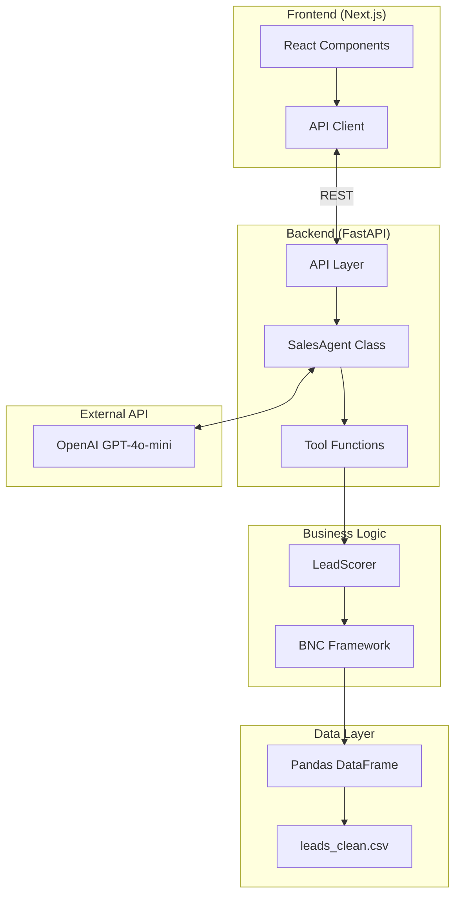
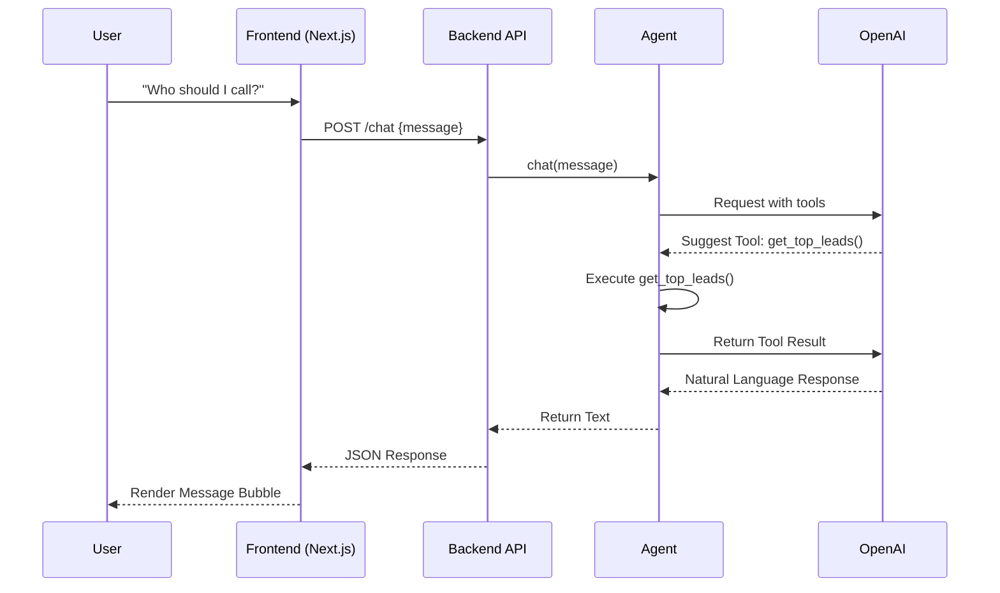
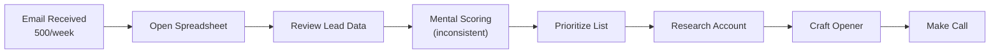
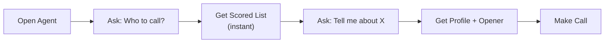

# SalesAgent

## Tech Stack
FastAPI, OpenAI

## Metadata
- Has docs folder: True
- Has frontend: True
- Has backend: True

# SalesAgent Documentation


---

## From: architecture.md

# 🏗️ Architecture Overview

> [!NOTE]
> This document outlines the technical design of the Sales Lead Prioritization Agent, focusing on modularity, scalability, and grounding in real-world data.


## High-Level Architecture



---

## 🧩 Components

### 1. 🖥️ User Interface (`frontend/`)
- **Technology**: Next.js 14, React, Tailwind CSS
- **Features**: 
  - Modern, responsive chat interface
  - "Hot Lead" badge visualization
  - Real-time streaming responses
  - Slate-themed professional aesthetic

### 2. ⚡ API Layer (`src/api/main.py`)
- **Technology**: FastAPI
- **Features**:
  - RESTful endpoints (`/chat`, `/stats`)
  - Global Agent singleton management
  - CORS configuration for frontend decoupling
  - Swagger/OpenAPI documentation auto-generation

### 3. 🤖 Agent Core (`src/agent/core.py`)
- **Technology**: OpenAI SDK (function calling)
- **Features**:
  - 4 specialized tool functions
  - State management (currently in-memory)
  - Dynamic system prompts

### 4. 🧠 Scoring Engine (`src/logic/scoring.py`)
- **Framework**: BNC + Internal Gap
- **Logic**: Pure Python/Pandas implementation of the 75th percentile framework.

---

## 🖼️ Visual Architecture Diagram


---

## 🔄 Data Flow



---

## 🛠️ Technology Decisions

| Decision | Choice | Rationale |
|:---|:---|:---|
| **Frontend** | **Next.js + Tailwind** | Staff-level polish, component reusability, production standard. |
| **Backend** | **FastAPI** | High performance, auto-docs, native async support for AI. |
| **LLM** | OpenAI GPT-4o-mini | Cost-effective, sufficient reasoning capability. |
| **Data** | CSV + Pandas | Simplicity for the "Craft Demo" constraint. |

---

## 📂 File Structure

```
SalesAgent/
├── frontend/                # Next.js Application
│   ├── src/app/             # React Pages
│   └── public/              # Static assets
├── src/
│   ├── api/
│   │   └── main.py          # FastAPI Server
│   ├── agent/
│   │   └── core.py          # Agent Logic
│   ├── logic/
│   │   └── scoring.py       # BNC Scoring
│   └── ui/
│       └── app.py           # (Legacy) Streamlit
├── data/
│   └── processed/           # CSV Data
└── docs/
    ├── architecture.md      # This file
    └── requirements.md      # PRD
```


---

## From: assumptions.md

# 📝 Assumptions & Constraints

> [!NOTE]
> This document captures the data-level assumptions and problem constraints identified during the initial analysis phase.
## Lead Prioritization Agent - Data & Problem Understanding

---

## 1. Data Source

**Assumption**: The lead data has already been extracted and structured.
- Source file: `output_data.xlsx` (4,999 rows)
- Data represents: Existing accounts showing buying signals
- No email parsing needed: Data is clean and ready for analysis

**Implication**: Agent focuses on prioritization and reasoning, not data extraction.

---

## 2. Lead Type

**Assumption**: These are **expansion/upsell opportunities** (not cold leads).

**Evidence**:
- `days_since_signup` → Accounts already exist
- `sessions_per_month`, `contacts_per_month` → Usage data available
- `paid_optional_features_count` → Already monetized to some degree

**Implication**: Prioritization should identify "engagement vs monetization gap"
- High usage + low paid features = strong upsell signal
- High revenue = spending power indicator

---

## 3. User Goal

**Assumption**: Salesperson's primary question = "Who should I call TODAY?"

**What the agent must provide**:
- Ranked list of accounts
- Reasoning for each recommendation
- Actionable talking points

**Not just**: Filtered search results
**But**: Strategic recommendations with "why"

---

## 4. Data Quality

**Known issues**:
- Phone numbers: Some have "z" prefix (OCR artifacts)
- Revenue: String format with "$" and commas (needs parsing)
- Employees: Some have spaces (e.g., "3 949" = 3,949)
- Column names: Truncated (`account_contac`, `tp_nhaomnee_number`)

**Implication**: Need data cleaning step before analysis.

---

## 5. Data Duplication

**Assumption**: Some companies have multiple rows in the dataset.

**Evidence**:
- `company_name` column shows duplicates
- `days_since_signup` → Accounts already exist
- `sessions_per_month`, `contacts_per_month` → Usage data available

**Implication**: Need to handle duplicates before analysis.

---
## 6. Data Structure: Multi-Account Companies

**Discovery**: Every company in the dataset has multiple accounts (avg ~47 per company).

**Interpretation**: These represent:
- Different departments/divisions using the product independently
- Separate budgets and decision-makers
- Enterprise/mid-market companies with decentralized purchasing

**Implication for Agent**:
- Account-level scoring (who to call)
- Company-level insights (enterprise opportunity detection)
- Cross-account pattern recognition
- Strategic account planning (not just tactical lead prioritization)

**Example**: 
"Complete Technologie" has 62 accounts:
- 30 with <3 features (upsell targets)
- 12 with 30+ sessions (engaged users)
- Combined revenue: $900M+ (enterprise budget)
→ Recommendation: Coordinate multi-account strategy

---

## 5. Column Interpretations

**No data dictionary was provided.** These interpretations are assumptions:

| Column | Our Interpretation | Confidence |
|--------|-------------------|------------|
| `sessions_per_month` | Product login sessions (usage) | Medium - could be sales meetings |
| `contacts_per_month` | Active users/seats at account | Medium - could be support contacts |
| `days_since_signup` | Account age | High |
| `revenue_usd` | Company annual revenue | High |

**Interview note**: First question to business would be "Can I get a data dictionary?"

---

## 6. Scoring Logic Rationale

**Why equal weights?**
- No historical conversion data to validate which signals matter more
- Starting with assumptions we can't defend would be bad practice
- In production: A/B test weights, optimize based on actual conversions

**Why 75th percentile thresholds?**
- Top 25% is a standard, defensible statistical approach
- Dynamic: adapts if customer base changes
- Easy to explain: "We target the top quarter"

**Why Internal Gap signal?**
- Data showed 105 companies with ~47 accounts each
- If one department adopted features, others are warm leads
- Sales angle: "Your colleagues in [dept] already use this"

---

## 7. What We Chose NOT to Include

| Column | Why Excluded from Scoring |
|--------|---------------------------|
| `number_of_employees` | Correlation with features: -0.002 (no signal) |
| `number_of_subsidiaries` | Correlation with features: -0.0004 (no signal) |
| `days_since_signup` | Correlation: -0.008. Used as context, not score |

**Key insight**: Almost no correlation between any column and `paid_optional_features_count`. This validates the "gap" approach - opportunity is about relative position, not absolute values.

## Next: To be added as we build
- Agent capabilities definition
- Scoring logic rationale  
- Technical architecture decisions
- LLM integration approach


---

## From: business_case.md

# 💼 Business Case: Lead Prioritization Agent

> [!IMPORTANT]
> Automating lead prioritization for the sales team using an AI agent can save approximately **208 hours per year** across a team of 10 reps, delivering an estimated **$12,500 annual ROI**.

---

## Current State (Manual Process)

### Process Map



### Time Spent (Per Rep, Per Week)

| Activity | Time (min) | Notes |
|----------|------------|-------|
| Review 500 emails | 60 | Quick scan |
| Score/prioritize leads | 45 | Mental BNC assessment |
| Research top accounts | 30 | Company lookup, history |
| Craft talking points | 30 | Custom for each lead |
| **Total** | **165 min** | ~2.75 hours/week |

### 🛑 Issues with Manual Process
1. **Inconsistent scoring** - Each rep has different criteria
2. **Missed opportunities** - No visibility into internal gaps
3. **Time drain** - Repetitive work takes focus from selling
4. **No institutional knowledge** - Scoring logic lives in heads

---

## Future State (Automated)

### Process Map



### Time Spent (Per Rep, Per Week)

| Activity | Time (min) | Improvement |
|----------|------------|-------------|
| Open agent, ask question | 5 | -55 min |
| Review AI-scored list | 10 | -35 min |
| Get talking points | 5 | -25 min |
| **Total** | **20 min** | **-145 min** |

---

## 💰 ROI Calculation

### 📋 Assumptions

| Parameter | Value | Notes |
|:---|:---|:---|
| Reps using system | 10 | Sales team size |
| Time saved per rep/week | 145 min | 2.4 hours |
| Weeks per year | 52 | |
| Loaded hourly cost | $50 | Salary + benefits |
| OpenAI API cost/month | $20 | ~1000 queries/month |

### 📈 Annual Savings

> [!NOTE]
> **Total Savings Calculation:**
> - Time saved = 10 reps × 145 min × 52 weeks = 754,600 min = 208 hours
> - Dollar value = 208 hours × $50/hour = $10,400
> - API cost = $20 × 12 = $240
> - **Net savings = $10,160/year**

### Development Investment

| Item | Hours | Cost @ $100/hr |
|------|-------|----------------|
| Data cleaning | 4 | $400 |
| Scoring logic | 4 | $400 |
| Agent development | 8 | $800 |
| UI development | 4 | $400 |
| Testing/documentation | 4 | $400 |
| **Total** | **24** | **$2,400** |

### Payback Period

```
Payback = $2,400 / ($10,160 / 12) = 2.8 months
```

---

## Qualitative Benefits

| Benefit | Impact |
|---------|--------|
| **Consistent scoring** | All reps use same BNC framework |
| **Internal gap detection** | Identifies cross-sell within companies |
| **Faster ramp** | New reps productive immediately |
| **Data-driven culture** | Decisions backed by numbers |
| **Conversation context** | Agent remembers within session |

---

## Risk Mitigation

| Risk | Mitigation |
|------|------------|
| LLM hallucination | Grounded in actual data via function calling |
| API outage | Graceful error handling, fallback to manual |
| Data staleness | Daily data refresh (future enhancement) |
| Adoption resistance | Gradual rollout, champion users first |

---

## ✅ Recommendation

> [!TIP]
> **Proceed with deployment immediately.** 
> - Low development cost ($2,400)
> - Fast payback (< 3 months)
> - Low ongoing cost ($240/year API)
> - High qualitative value (consistency, visibility)

The agent is ready for pilot with 2-3 reps before full team rollout.


---

## From: data_dictionary.md

# Data Dictionary

## Overview
This document describes the lead dataset and scoring framework for the Sales Agent project.

- **Source**: `leads_clean.csv`
- **Records**: 4,999 accounts
- **Companies**: 105 unique (avg ~47 accounts per company)

---

## 1. Data Schema

| Column | Type | Description | Range/Notes |
|--------|------|-------------|-------------|
| `account_id` | int | Unique account identifier | |
| `account_contact_name` | string | Contact person name | |
| `phone_number` | string | Contact phone | |
| `email` | string | Contact email | |
| `company_name` | string | Company name | 105 unique |
| `days_since_signup` | int | Account age in days | 1 - 1,825 |
| `number_of_subsidiaries` | int | Company subsidiaries | 0 - 8 |
| `revenue_usd` | float | Annual revenue | $145K - $49M |
| `number_of_employees` | int | Company headcount | 20 - 92K |
| `sessions_per_month` | int | Monthly product sessions | 0 - 40 |
| `contacts_per_month` | int | Monthly active users | 0 - 20 |
| `paid_optional_features_count` | int | Paid features count | 0 - 7 |

---

## 2. Assumptions

No data dictionary was provided. These are our interpretations:

| Column | Assumed Meaning | Confidence |
|--------|-----------------|------------|
| `sessions_per_month` | Product login sessions | Medium |
| `contacts_per_month` | Active users/seats | Medium |

**Interview note**: First question to business would be "Can I get a data dictionary?"

---

## 3. Scoring Framework: BNC + Internal Gap

### 3.1 Signals

| Signal | Column | Threshold | Rationale |
|--------|--------|-----------|-----------|
| **B**udget | `revenue_usd` | >= $22M (75th pct) | Capacity to pay |
| **N**eed | `sessions_per_month` | >= 30 (75th pct) | Product engagement |
| **C**ontacts | `contacts_per_month` | >= 15 (75th pct) | Stickiness |
| **Internal Gap** | `paid_optional_features_count` | < company median | Behind peers |

### 3.2 Scoring Logic

- Each signal = 1 point
- Score range: 0-4
- Equal weights (no conversion data to justify otherwise)

### 3.3 Score Distribution

| Score | Count | % | Tier |
|-------|-------|---|------|
| 4 | 30 | 0.6% | Hot |
| 3 | 322 | 6.4% | High |
| 2 | 1,266 | 25.3% | Medium |
| 1 | 2,051 | 41.0% | Low |
| 0 | 1,330 | 26.6% | Cold |

---

## 4. Columns Not Used in Scoring

| Column | Correlation with Features | Reason Excluded |
|--------|---------------------------|-----------------|
| `number_of_employees` | -0.002 | No predictive signal |
| `number_of_subsidiaries` | -0.0004 | No predictive signal |
| `days_since_signup` | -0.008 | Used as context, not score |

---

## 5. Human-in-the-Loop

Agent provides scores and reasoning. Salesperson decides:

- **Authority**: Is this the decision maker? (not in data)
- **Timeline**: Are they ready to buy? (not in data)
---


---

## From: deployment_render.md

# Render Deployment Fixes & Best Practices

This document summarizes the fixes applied to the SalesAgent project to ensure successful deployment on Render using Docker.

## Common Issues & Solutions

### 1. Project Type Misidentification
- **Issue**: Render detected a `package.json` (likely from a local `.venv` or `frontend` directory) and tried to use a Node.js builder.
- **Solution**: Created a `.dockerignore` file to exclude `.venv`, `frontend`, and other non-backend directories from the Docker build context. This forces Render to use the `Dockerfile`.

### 2. Missing Backend Dependencies
- **Issue**: Deployment failed because `fastapi` and `uvicorn` were not in `pyproject.toml`.
- **Solution**: Added `fastapi` and `uvicorn` to the dependencies list in `pyproject.toml` and updated `requirements.txt`.

### 3. Data Availability
- **Issue**: The application depends on `data/processed/leads_clean.csv`, which was gitignored.
- **Solution**: Updated `.gitignore` to allow committing the `data/processed/` directory so the container has access to required data.

### 4. Dynamic Port Mapping
- **Issue**: Render assigns a dynamic port via the `$PORT` environment variable, but the `Dockerfile` was hardcoded to `8000`.
- **Solution**: Updated the `Dockerfile` `CMD` to use `sh -c` for environment variable expansion:
  ```dockerfile
  CMD ["sh", "-c", "uvicorn src.api.main:app --host 0.0.0.0 --port ${PORT:-8000}"]
  ```

### 5. Deployment Reliability
- **Issue**: No automatic health monitoring.
- **Solution**: Added a `HEALTHCHECK` to the `Dockerfile` targeting the `/health` endpoint.

## Deployment Checklist
1. **Docker Environment**: Ensure Render service "Environment" is set to **Docker**.
2. **Environment Variables**: Add `OPENAI_API_KEY` in the Render dashboard.
3. **Data Files**: Ensure `data/processed/` files are committed and pushed.
4. **Build Context**: Verify `.dockerignore` is present to prevent builder confusion.


---

## From: deployment_vercel.md

# Vercel Deployment Guide

This document outlines the steps to deploy the SalesAgent frontend on Vercel and connect it to the Render backend.

## 1. Import Project to Vercel
1.  Go to the [Vercel Dashboard](https://vercel.com/dashboard).
2.  Click **Add New...** > **Project**.
3.  Select your repository (`SalesAgent`).

## 2. Configure Project Settings

> [!IMPORTANT]
> The Next.js application is located in the `frontend` subdirectory, not the root.

-   **Framework Preset**: Next.js
-   **Root Directory**: Click **Edit** and select `frontend`.

## 3. Configure Environment Variables
Expand the **Environment Variables** section and add the following:

| Key | Value | Description |
| :--- | :--- | :--- |
| `NEXT_PUBLIC_API_URL` | `https://sales-agent-api-5597.onrender.com` | URL of your live Render backend |

## 4. Deploy
Click **Deploy**. Vercel will build your application.

## 5. Post-Deployment: Update Backend CORS
Once deployed, Vercel will assign a URL to your project (e.g., `https://sales-agent-frontend.vercel.app`). You must allow this URL in your Render backend settings.

1.  Copy your new Vercel URL.
2.  Go to your **Render Dashboard**.
3.  Select your `sales-agent-api` service.
4.  Go to **Environment**.
5.  Edit the `ALLOWED_ORIGINS` variable (or create it if it doesn't exist).
6.  Add your Vercel URL to the list (comma-separated).
    *   **Example**: `http://localhost:3000,http://localhost:3001,https://your-app.vercel.app`


---

## From: presentation_and_interview_prep.md

# 🎙️ Sales Agent: Presentation & Interview Preparation Guide

This document provides a complete toolkit for presenting the Sales Agent "Craft Demonstration" and handling deep-dive technical interview questions.

---

## 📊 Part 1: Presentation Deck (PPT) Content

**Theme**: "From Noise to Signal: Intelligent Lead Prioritization"

### Slide 1: Title Slide
- **Title**: Intelligent Sales Automation Agent
- **Subtitle**: Automating Lead Prioritization with BNC Framework & GenAI
- **Presenter**: Data Scientist, Intelligent Automation

### Slide 2: The Problem (Context)
- **Visual**: A frustrated salesperson staring at a spreadsheet with 5,000 rows.
- **Bullets**:
  - Sales reps spend **40% of time** just finding who to call.
  - "Cherry-picking" bias leads to missed opportunities.
  - High volume of data (Revenue, Sessions, Contacts) is hard to process mentally.
- **Talking Point**: "We have data, but we lack **insight**. Our reps are drowning in rows but starving for context."

### Slide 3: The Solution (BNC + Internal Gap)
- **Visual**: Funnel diagram showing Raw Leads -> BNC Filter -> Top Targets.
- **Framework**:
  - 💰 **Budget**: Top 25% Revenue
  - 📈 **Need**: Top 25% Session Activity
  - 👥 **Stickiness**: Top 25% Contact Count
  - 🎯 **Gap**: Usage < Company Median (Calculated)
- **Talking Point**: "We don't need 'fancy' AI for everything. We need a deterministic scoring layer first to filter the signal, *then* we specific AI for the communication."

### Slide 4: System Architecture (Current vs. Future)
- **Visual**:
  - **Left (Current)**: CSV -> Python Logic -> **FastAPI (Backend)** -> **Next.js (Frontend)**.
  - **Right (Scalable)**: Data Warehouse (Snowflake) -> Airflow (ETL) -> Vector DB + Metadata -> Orchestration Layer (Router) -> UI.
- **Talking Point**: "Today's demo uses a modern decoupled architecture (React/FastAPI) which is closer to production standards than a simple Streamlit prototype."

### Slide 5: The "Craft" (Demo Highlights)
- **Visual**: Screenshot of the Chat Interface.
- **Key Features to Demo**:
  1. **"Who should I call?"** (Shows automated ranking).
  2. **"Why them?"** (Shows interpretability/reasoning).
  3. **"What do I say?"** (Shows generative context).
- **Talking Point**: "It's not just a list; it's a coaching tool. It gives the 'Why' behind the ranking."

---

## 🧠 Part 2: Interview Deep Dives & Reasoning

Here are the specific, tough questions likely to be asked about *scalability* and *robustness*, with the "Staff Data Scientist" answers.

### 1. "We used CSV here, but real data is messy. How do we automate cleaning?"
**Answer**:
- **Current**: We assume a clean export for the demo.
- **Real World**: We would implement an **ETL Pipeline** (e.g., dbt + Airflow).
- **Data Quality (DQ) Checks**:
  - Use a tool like **Great Expectations** or **dbt tests** in the pipeline.
  - *Example*: `expect_column_values_to_be_not_null("revenue")`.
  - If data is "dirty" (e.g., text in revenue fields), the pipeline fails proactively *before* it hits the agent, alerting the data engineer.

### 2. "What if extra columns are added? Is the code intelligent enough?"
**Answer**:
- **Strictly Speaking**, No. The current code (`scoring.py`) is **brittle** because it hardcodes specific column names (`revenue_usd`, `sessions_per_month`).
- **Impact**:
  - *Extra Columns*: Ignored (Pandas default). The framework continues to work but ignores new signals.
  - *Renamed/Missing Columns*: The application crashes.
- **The Fix**: Move configuration to a YAML config file.
  - Define `signals: ["revenue_usd", "new_signal_x"]`.
  - The scorer dynamically iterates over this config to generate the score, making it "intelligent" enough to adapt to schema changes without code rewrites.

### 3. "How do we handle 20 concurrent sales agents?" (CRITICAL FINDING)
**Answer**:
- **Current Bottleneck**: "I identified a critical concurrency bug in the current code."
  - The `agent` instance in `main.py` is initialized globally: `agent = create_agent()`.
  - This means `agent.conversation_history` is shared across ALL users.
- **The Fix**:
  - **Stateless Architecture**: The backend should just handle requests.
  - **Session State**: Store conversation history in the user's session (e.g., Redis or strictly in the Next.js frontend state), NOT in the global Agent class instance.
  - **Read-Only Data**: The `Scorer` (heavy read-only data) *can* be a global singleton. The `Agent` (stateful) must be instantiated per-request or per-user.

### 4. "How do we automate deployments (CI/CD)?"
**Answer**:
- **Current**: Manual push to Render.
- **Scalable**: GitHub Actions Pipeline.
  1. **Lint/Test**: On PR, run `pytest` and `flake8`.
  2. **Build**: Build Docker container.
  3. **Deploy (Staging)**: Push to Staging environment.
  4. **Integration Test**: Run synthetic agent queries against Staging.
  5. **Deploy (Prod)**: Auto-promote if tests pass.

### 5. "Data is in emails. How do we automate that?"
**Answer**:
- We need an **Ingestion Connector** (e.g., SendGrid Inbound Parse or Microsoft Graph API).
- **Workflow**:
  1. Trigger: New Email.
  2. **Extraction Agent** (New LLM component): "Complete this JSON schema based on the email body."
  3. **Validation**: Check if extracted revenue/contact info looks valid.
  4. **Upsert**: Push to the Database/CSV.
- *Challenge*: Emails are unstructured. We will need a strong parsing prompt and manual fallback ("Human in the Loop") for low-confidence parsings.

### 6. "How do we track conversions and make the LLM learn?"
**Answer**:
- **Do we have an LLM model?**: No, we use a frozen API model (GPT-4o). It does *not* learn online.
- **The Loop**:
  1. **Feedback UI**: Add "👍/👎 - Was this lead good?" buttons in the UI.
  2. **Outcome Tracking**: Integrate with CRM (Salesforce) to see if "Won Deal" flags appear for high-scored leads.
  3. **Optimization**:
    - *Short term*: We tune the *prompt* (Few-Shot examples of successful leads).
    - *Long term*: We fine-tune a smaller model (Llama 3) on our proprietary "Good Lead" dataset to replace the generic GPT-4o, lowering costs and increasing specificity.

### 7. "Scaling to Multiple Models (Router Pattern)"
**Answer**:
- **Reasoning**: GPT-4o is expensive. Claude is great for writing. Gemini is massive context.
- **Implementation**:
  - Build a **Router** function.
  - *Input*: "Draft an email to Kevin." -> *Router*: "This is a creative task." -> *Route*: **Claude 3.5 Sonnet**.
  - *Input*: "Filter leads by revenue." -> *Router*: "This is a logic task." -> *Route*: **Llama 3 (local/fast)** or **simple SQL**.
- **Code Change**: Abstract `self.client` into a `ModelProviderFactory` that accepts a `task_type` argument.

---

## 🔍 Part 3: Codebase Breakdown (The Honest Assessment)

| Aspect | Status | Verdict |
| :--- | :--- | :--- |
| **Flexibility** | 🔴 Rigid | Hardcoded logic in `scoring.py`. Cannot handle schema changes dynamically. |
| **Error Handling** | 🟡 Partial | Basic try/except for lookups. No global error boundary. If OpenAI API fails, the app likely crashes or hangs. |
| **Intelligence** | 🟡 Basic | It's a "Rule-based System" (BNC) wrapped in an LLM interface. The "Intelligence" is in the scoring math, not the AI reasoning. |
| **Concurrency** | 🔴 Broken | **Critical Issue**: Global state sharing would cause cross-talk between agents. |
| **Scalability** | 🟢 Decent | The logic (Pandas) is fast for <100k rows. For >1M rows, we'd need Spark or SQL pushdown. |

---

## 🚀 Part 4: Future Roadmap (If given more time)

**Must Haves (Priority 1)**:
1. **Fix Concurrency**: Refactor `SalesAgent` to be stateless; move history to a database or frontend state (Next.js).
2. **Robustness**: wrap OpenAI calls in `tenacity` retry logic (for API timeouts).

**Nice to Haves (Priority 2)**:
1. **Dynamic Config**: Move thresholds (75th percentile) to a `config.yaml` so business users can tweak "Stictness" without code changes.
2. **CRM Integration**: Instead of reading CSV context processing, read directly from Salesforce/HubSpot API.


---

## From: presentation_slides.md

---
marp: true
theme: default
paginate: true
backgroundColor: #ffffff
style: |
  section {
    font-family: 'Arial', sans-serif;
  }
  h1 {
    color: #2c3e50;
  }
  h2 {
    color: #34495e;
  }
  .lead {
    font-size: 1.5rem;
    color: #555;
  }
---

# From Noise to Signal
## Intelligent Sales Lead Prioritization

**Presenter**: Data Scientist, Intelligent Automation
*Date: January 12, 2026*

---

# The Problem: Drowning in Data

- **Overview**: Sales reps spend **40% of their time** just finding who to call.
- **Pain Point**: "Cherry-picking" leads causes missed opportunities.
- **Challenge**:
  - High volume of data (Revenue, Sessions, Contacts).
  - Manual filtering is slow and biased.
- **Impact**: We have data, but we lack *insight*.

---

# The Solution: BNC + Internal Gap Framework

We combine deterministic scoring with AI reasoning.

1. **💰 Budget**: Top 25% Revenue (> $X M)
2. **📈 Need**: Top 25% Session Activity (> Y sessions)
3. **👥 Stickiness**: Top 25% Contact Count (> Z contacts)
4. **🎯 Internal Gap**: 
   - *Key Signal*: Usage < Company Median
   - *Opportunity*: Upsell to peer level.

---

# System Architecture

## Current (MVP)
`CSV Data` → `Python Logic` → `FastAPI` → `Next.js UI`

## Future (Scalable)
`Snowflake/DW` → `Airflow (ETL)` → `Vector DB` → `Agent Router` → `Web UI`

> **Note**: The core logic is decoupled, ready to be lifted-and-shifted to a cloud pipeline.

---

# The "Craft": Demo Highlights

1. **"Who should I call?"**
   - Automated ranking based on the BNC score (0-4).
   
2. **"Why them?"**
   - Explainable AI: "High budget, high need, but low feature adoption."

3. **"What do I say?"**
   - Generative context: Tailored talking points for the specific contact.

---

# Scalability & Robustness

- **Data Pipelines**:
  - Move from CSV to **ETL Pipelines** (Airflow/dbt) with Data Quality checks.
  - Handle dirty data *before* it reaches the agent.
  
- **Concurrency**:
  - **Refactor Identified**: Move from Global Singleton to **Stateless Session Architecture** (Redis/Session State) to support 20+ simultaneous agents.

- **Deployment**:
  - Implement **CI/CD** (GitHub Actions) for automated testing and deployment.

---

# Future Roadmap

- **Phase 1: Robustness**
  - Fix concurrency (Stateless).
  - Add API retry logic (Tenacity).

- **Phase 2: Intelligence**
  - Dynamic Configuration (YAML-based scoring).
  - **Router Pattern**: Use Claude for writing, GPT-4o for reasoning.

- **Phase 3: Integration**
  -  Direct CRM Integration (Salesforce API).
  -  Email Ingestion Connectors.

---

# Q&A

**Thank You**


---

## From: requirements.md

# 📜 Product Requirements Document: Sales Lead Agent

> [!NOTE]
> This PRD defines the core functionality and success metrics for the Sales Prioritization automation project.

## 1. Project Overview
The goal is to automate the daily lead prioritization process for the sales team. The system will ingest structured account data, apply a BNC (Budget, Need, Contacts) + Internal Gap framework, and provide an interactive interface for sales reps to identify high-priority leads.

---

## 2. Functional Requirements

### 2.1 Lead Scoring Engine
- **FR-1**: Must calculate a score (0-4) based on four binary signals.
- **FR-2**: **Budget Signal**: Account revenue must be in the top 25% of the dataset.
- **FR-3**: **Need Signal**: Account sessions per month must be in the top 25% of the dataset.
- **FR-4**: **Stickiness Signal**: Active contacts must be in the top 25% of the dataset.
- **FR-5**: **Internal Gap Signal**: Account must have fewer paid features than the median for its parent company.

### 2.2 Conversational Agent
- **FR-6**: Must provide a natural language interface for querying leads.
- **FR-7**: Must support "Get Top Leads" query with configurable thresholds.
- **FR-8**: Must support "Account Deep Dive" for specific contact names or IDs.
- **FR-9**: Must support "Company Insights" to show cross-account opportunities.
- **FR-10**: Must maintain session context (memory) for follow-up questions.

### 2.3 User Interface
- **FR-11**: Must provide a web-based dashboard for interaction.
- **FR-12**: Must display scoring criteria and dataset statistics.

---

## 3. Non-Functional Requirements

### 3.1 Accuracy & Grounding
- **NFR-1**: The agent must ONLY use data provided in the CSV.
- **NFR-2**: Tool calls must be used for all data-specific queries to prevent hallucinations.

### 3.2 Performance
- **NFR-3**: Agent responses should typically be delivered under 5 seconds.
- **NFR-4**: Data scoring must be performed once at startup for high performance.

### 3.3 Maintainability
- **NFR-5**: Scoring logic must be decoupled from the LLM agent (Modular design).
- **NFR-6**: Code must have unit test coverage for the scoring engine.

---

## ✅ Acceptance Criteria (AC)

### 🎯 AC-1: Successful Prioritization
- **Given** a dataset of 5,000 leads,
- **When** the agent is asked for "Top Leads",
- **Then** it must return a list of accounts with Score 4, explaining the revenue, sessions, and feature gap.

### AC-2: Company Opportunity Detection
- **Given** a company with multiple accounts (e.g., "Optimal Systems"),
- **When** asked "Show me leads at Optimal Systems",
- **Then** it must identify which accounts are high-usage but low-monetization compared to their peers.

### AC-3: Context Persistence
- **Given** a user has asked about "Kevin Long",
- **When** the user follows up with "What should I say to him?",
- **Then** the agent must provide talking points without the user re-specifying the name.

### AC-4: Technical Reliability
- **Given** the test suite is run,
- **Then** 100% of scoring unit tests must pass.


---

## From: walkthrough.md

# 🚀 Sales Agent - Implementation Walkthrough

> [!NOTE]
> This walkthrough highlights the key technical and strategic milestones achieved in building the Sales Lead Prioritization Agent.

---

## What Was Built

### 1. Production Agent Module
**File**: [core.py](file:///Users/apurva/Projects/AI_Agents/SalesAgent/src/agent/core.py)

Extracted agent logic from notebook into reusable `SalesAgent` class:
- 4 tool functions (get_top_leads, get_account_details, get_company_accounts, search_leads)
- Conversation memory for multi-turn chat
- Dynamic system prompt with scoring thresholds
- Error handling and logging

---

### 2. Full-Stack Web Interface (Next.js + Tailwind)
**Files**: [FastAPI Backend](file:///Users/apurva/Projects/AI_Agents/SalesAgent/src/api/main.py), [Next.js Frontend](dir:///Users/apurva/Projects/AI_Agents/SalesAgent/frontend)

Transitioned to a professional web stack for maximum design control:
- **⚛️ Next.js 15**: Robust React framework for the frontend.
- **🎨 Tailwind CSS**: Utility-first CSS for the high-fidelity Slate SaaS design.
- **⚡ FastAPI**: High-performance Python backend for the agent logic.
- **🏷️ Smart Badges**: Real-time Tailwind-styled score badges (🔥 Priority 4, 🟠 Priority 3).
- **📱 Responsive Layout**: Professional sidebar and chat interface that works on all devices.

**To run the Backend:**
```bash
uv run uvicorn src.api.main:app --reload
```

**To run the Frontend:**
```bash
cd frontend
npm run dev
```

---

### 3. Architecture Documentation
**File**: [architecture.md](file:///Users/apurva/Projects/AI_Agents/SalesAgent/docs/architecture.md)

Contains:
- High-level Mermaid diagram
- Component descriptions
- Data flow sequence diagram
- Technology decision rationale

---

### 3. Requirements & Acceptance Criteria
**File**: [requirements.md](file:///Users/apurva/Projects/AI_Agents/SalesAgent/docs/requirements.md)

- Formal PRD with Functional and Non-Functional requirements.
- **Acceptance Criteria**: Defined for Prioritization, Opportunity Detection, and Context Persistence.

### 4. Business Case
**File**: [business_case.md](file:///Users/apurva/Projects/AI_Agents/SalesAgent/docs/business_case.md)

Contains:
- Process maps (current vs automated)
- Time savings: 145 min/week per rep
- Annual ROI: ~$10,000
- Payback period: 2.8 months

---

## Verification Results

### Automated Tests
**Scoring Logic**:
- `test_calculate_score` PASSED
- `test_internal_gap_calculation` PASSED
- `test_threshold_calculation` PASSED
- `test_zero_score` PASSED

**Agent Logic (Unit Tests)**:
- `test_tool_mapping` PASSED
- `test_clear_history` PASSED
- `test_get_top_leads_logic` PASSED
- `test_chat_tool_execution_flow` PASSED

Total: 9 tests passed.

### Module Imports
- ✅ `src/agent/core` - imports successfully
- ✅ `src/ui/app` - imports successfully
- ✅ Streamlit installed (v1.52.2)

---

### 📂 File Structure

```
SalesAgent/
├── src/
│   ├── agent/
│   │   └── core.py         ← 🚀 Production agent
│   ├── logic/
│   │   └── scoring.py      ← 🧠 BNC scorer
│   └── ui/
│       └── app.py          ← 🖥️ Streamlit UI
├── docs/
│   ├── architecture.md     ← 🏗️ With diagrams
│   ├── assumptions.md      ← 📝 Context
│   └── business_case.md    ← 💰 ROI analysis
└── tests/
    └── test_scoring.py     ← ✅ 9 tests passing
```

---

## 🖼️ Architecture Overview


---

## From: README.md

# Sales Agent Intelligence Dashboard 🚀

A high-fidelity SaaS platform that prioritizes sales leads using the **BNC + Internal Gap** framework. It analyzes revenue, monthly sessions, contact frequency, and feature adoption gaps to find your hottest opportunities.

---

## ⚡️ Quick Reference Guide

### To Start

**1. Terminal 1: Backend (FastAPI)**
```bash
uv run uvicorn src.api.main:app --reload
```

**2. Terminal 2: Frontend (Next.js)** 
*Open a **new** terminal tab/window and run:*
```bash
cd frontend && npm run dev
```
*Access at: [http://localhost:3000](http://localhost:3000)*

---

## 🌎 Production Deployment (Public Link)

Follow these steps to get your dashboard live for anyone to access:

### 1. The Backend (Render.com)
- Create a **Web Service** on Render.
- Connect this repo and select the `main` branch.
- **Environment Variables**:
  - `OPENAI_API_KEY`: Your OpenAI key.
  - `PORT`: 8000 (Render usually sets this automatically).
- **Start Command**: `uvicorn src.api.main:app --host 0.0.0.0 --port $PORT`

### 2. The Frontend (Vercel.com)
- Add a **New Project** on Vercel.
- Select the `frontend` directory.
- **Environment Variables**:
  - `NEXT_PUBLIC_API_URL`: Paste your **Render Web Service URL** here (e.g., `https://sales-api.onrender.com`).
- Deployment will be instant!

---

### To Stop
Run this in **any** terminal to shut down both systems immediately:

```bash
pkill -f uvicorn && pkill -f next-server
```

---

## 🛠 Tech Stack
- **AI**: GPT-4o-mini (via OpenAI SDK)
- **Backend**: FastAPI (Python)
- **Frontend**: Next.js 15, Tailwind CSS, Lucide Icons
- **Logic**: Pandas for scoring & data analysis

## 📂 Project Structure
- `src/agent/core.py`: Main AI Agent logic & tools.
- `src/api/main.py`: FastAPI server endpoints.
- `frontend/src/app/page.tsx`: Premium dashboard UI.
- `data/processed/leads_clean.csv`: The lead dataset.

## 🧪 Verification
Run tests to ensure everything is working correctly:
```bash
python3 -m pytest tests/test_agent.py -v
```


